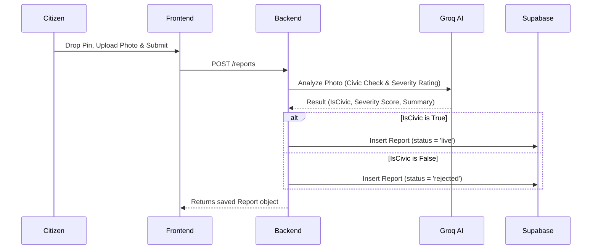

# 🛡️ Bharat Patrol - Project Handoff Documentation

Welcome to **Bharat Patrol** (formerly TraceSpark), an AI-powered civic grievance mapping and automated escalation system. This document outlines the project's technical architecture, database schemas, key workflows, environment configurations, and setup instructions.

---

## 🚀 Project Overview

**Bharat Patrol** is designed to empower citizens by letting them map civic issues (e.g., road damage, open drains, garbage piles) in real time. 
* **Validation**: Submissions are automatically validated by AI (Groq Llama 3 Vision) to check for authentic civic issues and reject non-civic photos.
* **Prioritization**: Issues are upvoted by the community to increment their priority score.
* **Escalation**: Once an issue reaches **25 votes**, the system automatically drafts a detailed complaint and dispatches an automated alert via WhatsApp to the local Ward Councillor.

---

## 🛠️ Technology Stack

### 1. Frontend
* **Framework**: React (Vite SPA)
* **Styling**: Tailwind CSS v4 & custom modern vanilla CSS (`src/index.css`)
* **Mapping Engine**: Leaflet & React-Leaflet
* **Iconography**: Lucide React
* **Weather Integration**: Open-Meteo API

### 2. Backend
* **Runtime**: Node.js & Express
* **Database**: Supabase (PostgreSQL)
* **AI Engine**: Groq SDK (Llama 3.1 Vision 11B for photo validation, Llama 3.1 8B for message drafting)
* **Messaging Service**: Twilio API (WhatsApp Business channel integration)

---

## 🗄️ Database Schema (Supabase)

The project relies on four tables inside Postgres:

### 1. `users` Table
Tracks registered citizens.
```sql
CREATE TABLE users (
    id UUID PRIMARY KEY DEFAULT gen_random_uuid(),
    name TEXT NOT NULL,
    phone TEXT UNIQUE NOT NULL,
    ward TEXT,
    password_hash TEXT,
    created_at TIMESTAMP WITH TIME ZONE DEFAULT timezone('utc'::text, now()) NOT NULL
);
```

### 2. `reports` Table
Stores civic grievances submitted by citizens.
```sql
CREATE TABLE reports (
    id UUID PRIMARY KEY DEFAULT gen_random_uuid(),
    user_id UUID REFERENCES users(id) ON DELETE SET NULL,
    lat DOUBLE PRECISION NOT NULL,
    lng DOUBLE PRECISION NOT NULL,
    category TEXT NOT NULL,
    photo_url TEXT NOT NULL,
    ai_verified BOOLEAN DEFAULT false,
    ai_severity INTEGER DEFAULT 1,
    description TEXT,
    priority_score INTEGER DEFAULT 0,
    status TEXT DEFAULT 'pending' CHECK (status IN ('pending', 'live', 'rejected')),
    created_at TIMESTAMP WITH TIME ZONE DEFAULT timezone('utc'::text, now()) NOT NULL
);
```

### 3. `votes` Table
Stores unique citizen votes for reports to prevent double voting.
```sql
CREATE TABLE votes (
    id UUID PRIMARY KEY DEFAULT gen_random_uuid(),
    report_id UUID REFERENCES reports(id) ON DELETE CASCADE,
    user_id UUID REFERENCES users(id) ON DELETE CASCADE,
    created_at TIMESTAMP WITH TIME ZONE DEFAULT timezone('utc'::text, now()) NOT NULL,
    UNIQUE (report_id, user_id)
);
```

### 4. `notifications` Table
Records escalations sent to ward councillors to prevent duplicate WhatsApp spams.
```sql
CREATE TABLE notifications (
    id UUID PRIMARY KEY DEFAULT gen_random_uuid(),
    report_id UUID REFERENCES reports(id) ON DELETE CASCADE,
    sent_at TIMESTAMP WITH TIME ZONE DEFAULT timezone('utc'::text, now()) NOT NULL
);
```

---

## 🔄 Core Workflows

### 1. Report Submission & AI Validation


### 2. Voting & Auto-Escalation
* When a user votes, the frontend sends `POST /reports/:id/vote`.
* The backend attempts to write to the `votes` table. Postgres unique constraint (`report_id`, `user_id`) natively intercepts duplicate votes.
* If it is a new vote, the report's `priority_score` increments by 1.
* If the `priority_score` hits **25**:
  1. The backend drafts an AI complaint message with category, severity, coordinates, and Google Maps location.
  2. Twilio dispatches a WhatsApp notification to the councillor's mobile number (`COUNCILLOR_PHONE`).
  3. Inserts a record in `notifications` to prevent future duplicate triggers.

---

## ⚡ Key UI Features Implemented

* **Google Maps Location Ball**: Pulsing translucent outer halo surrounding a bright blue location dot (replaces default emoji tooltips).
* **Leaflet Overlay Event Blocks**: Uses native Leaflet `L.DomEvent.disableClickPropagation` and `disableScrollPropagation` on custom widgets so interactions (zoom buttons, tool dock) do not trigger card/pin drops.
* **Custom Zoom Widget**: Floats at `bottom-24 left-4` tracking the current zoom level dynamically.
* **Clean Grievance History Sidebar**: Removed the gamified Leaderboard tab. The panel displays "My Submissions" history directly.
* **Unique Upvote Buttons**: The upvote button becomes a disabled, solid green **"Voted"** button if the user has already upvoted the report.

---

## ⚙️ Environment Configurations

### Backend `.env`
```env
PORT=5000
SUPABASE_URL=your_supabase_url
SUPABASE_KEY=your_supabase_anon_or_service_key
GROQ_API_KEY=your_groq_api_key
TWILIO_ACCOUNT_SID=your_twilio_sid
TWILIO_AUTH_TOKEN=your_twilio_auth_token
TWILIO_WHATSAPP_NUMBER=whatsapp:+14155238886 (Twilio Sandbox or Business Number)
COUNCILLOR_PHONE=whatsapp:+91xxxxxxxxx (Target phone for escalations)
```

### Frontend `.env`
```env
VITE_API_BASE_URL=https://team-charlie-tuhu.onrender.com (or http://localhost:5000 in local dev)
```

---

## 💻 Local Setup Instructions

### Prerequisites
* Node.js v18+ installed.

### 1. Set Up Backend
```bash
cd backend
npm install
# Create .env and insert values
npm start
```

### 2. Set Up Frontend
```bash
cd frontend
npm install
# Create .env and configure VITE_API_BASE_URL
npm run dev
```

---

## ☁️ Deployment Reference

* **Frontend**: Hosted on **Vercel** (`https://bharat-patrol.vercel.app/`). Automatically redeploys on pushes to `main`.
* **Backend**: Hosted on **Render** (`https://team-charlie-tuhu.onrender.com`). Automatically redeploys on pushes to `main`.
